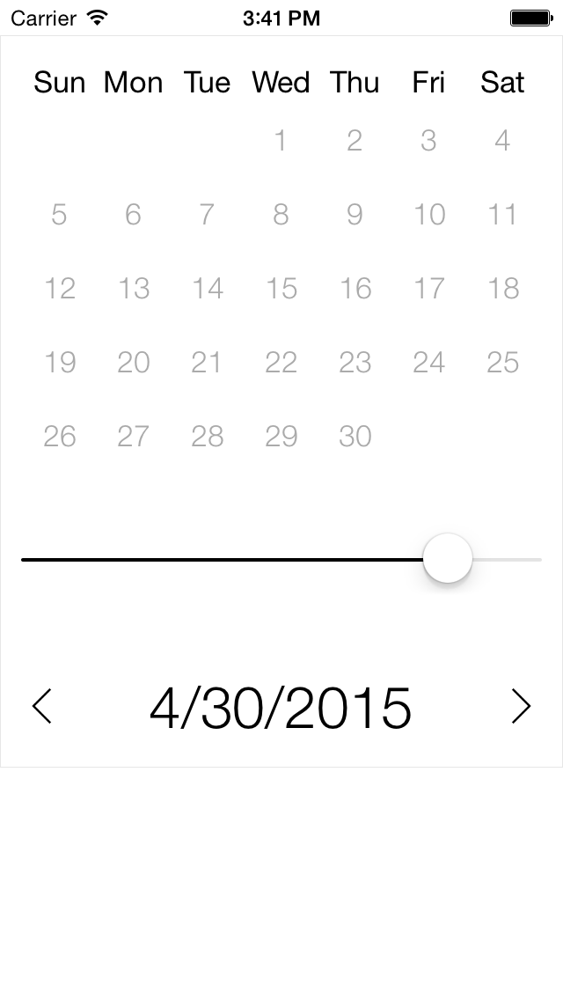

# slide-calendar
A simple and minimalistic calendar for xamarin-ios.  
I couldn't find a calendar that suit my necessities so I quickly built slide-calendar.  
Feel free to use it and add as many functionalities as you wish.  

###Functionalities
- Display the calendar  
- Use the slider to quickly go to a month
- Specify start and end date

The calendar will trigger an event when a date is selected.  
There is no highlight for current date and there are no easy hooks to change the calendar proprieties.  
Feel free to modify and add them, this is just a starting point.

###Screenshots  

